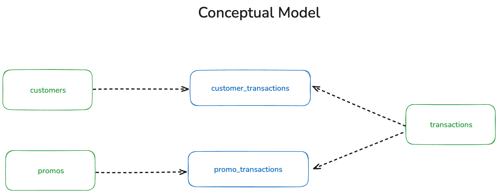

# Starbucks Customer Data

This dbt project is part of the Analytics Engineering Module from Data Engineering Course of [EDIT](https://weareedit.io/formacao/data-engineering-porto/) academy.

It uses data from Starbucks Customer provided by [Kaggle](https://www.kaggle.com/datasets/ihormuliar/starbucks-customer-data/).

## Business-driven questions
Starbucks provided these datasets to simulate how the customers interact with a specific promotional deal.

Potential business questions:

1. **What types of customers are more likely to respond to promotional offers?**
2. **Which promotional offers drive the highest engagement and lead to customer transactions?**
3. **How do different communication channels (email, mobile, etc.) impact offer response rates?**

## Data Sources
The data sources are available under `starbucks_raw` dataset in the provided BigQuery project identifier.

These datasets were provided by Starbucks to simulate customers and transaction data, aiming to explore better approaches for sending promotional deals to customers.

- `customers` - information about the promotional offers that are possible to receive, and basic information about each one.
- `promos` - information about the customers that are part of the promotional offers program.
- `transactions` - information about the different steps of promotional offers that a customer receives. It also contains information about the transactions that the customer makes.

## Conceptual Model
The following diagram shows the conceptual model of the Starbucks Customer data. Each box represents a domain's entity on the Starbucks business processes. The business events identified are: **transaction** and **promotional offer**.

Based on the diagram above, it is possible to identify the domain's entities which provide context to the business event (who, what, where, why, how):
- *customer*
- *transactions*
- *promos*

It is also possible to identify the domain's entities which aggregate the context and measures of each business event:
- *customer_transactions*
- *promo_transactions*

## Data Models
### Staging layer
It creates the individual domain's entities from the source data.

- `stg_customers`
- `stg_promos`
- `stg_transactions`

### Marts layer
It bridges the domain's entities together, enriching the vision of the entities:

- `dim_customer`
- `dim_date`
- `dim_promo`
- `fct_customers_transactions`
- `fct_promos_transactions`
